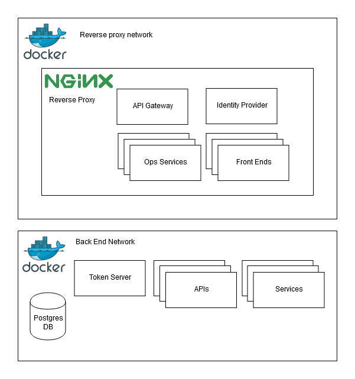

# vm-infrastructure

This repo contains a number of projects needed for setting up a basic virtual machine capable of serving a varity of services and applications. The content of the folders is set up specifically for my use case. In the libraries an NGINX reverse proxy sits infront of an API-Gateway, Identity Provider, some dev-ops tooling and a number of front ends. These are all on the same docker bridge network as the reverse proxy, a number of other API's are stored behind the API-Gateway and require authentication to get to.

Infrastructure Diagram
